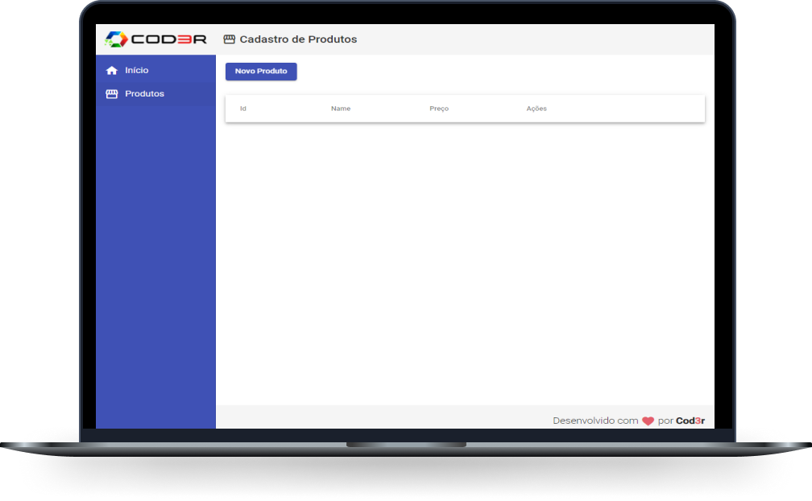

<h1 align="center">
  
</h1>

  <a href="#-tecnologias">Tecnologias</a>&nbsp;&nbsp;&nbsp;|&nbsp;&nbsp;&nbsp;
  <a href="#-projeto">Projeto</a>

 

  

## 🚀 Tecnologias

Esse projeto foi desenvolvido com os principais conceitos do Angular 9:

- Componentes
- Pipes
- Services
- e muito mais...

 

## 💻 Projeto

Este projeto foi replicado do Cusro de Angular 9 - Essencial da Cod3r. 

A aplicação reproduz um cadastro (CRUD) com Criação, Leitura, Atualização e Exclusão de Produto simulando uma API REST com Json Server. 

